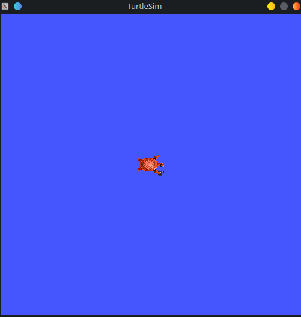

# Basics: ROS2 in command line

**Author**: Geoffrey [@Meltwin](https://github.com/Meltwin){:target="_blank"} Côte

---

When working on the ROS environment, the tool that you will use most of the time (when not writing) is the command line executable. Indeed, everytime you'll want to launch a ROS executable you made, or a whole stack for a robot, or even for some simple debugging or testing, you'll need to go through the command line. So it's important that you experience it from the beginning.

!!! warning
    Before going further, you should maybe familiarize yourself more with the shell terminal as you will sometimes have to switch between directories, quickly edit a file, or setup environment variables. Classic command would be:

    - `ls`: to get a list of the file in the directory,
    - `cd <dir>`: to navigate between directories (e.g. `cd mydir` or `cd ..` to move to the parent directory),
    - `rm <file>`: to permantly delete a file from the disk. If you want to delete a whole directory instead, use `rm -r <dir>`,
    - `mv <old location> <new location>`: to move a file from the old location to the new location.

    You should also know how to read command line arguments help. The format is very popular you might have already encountered it. For example, the command `foo <bar> [-j <K> ...]` (this is not a real command, so it won't work in your terminal) can be read it as:

    - `foo` is a static term so you should write it directly,
    - `<bar>` is a **mandatory** argument so you should replace it by the corresponding value,
    - `[-j <K>]` is an **optional** argument so you should add this part only if you need it, and replace `<K>` by the correct value,
    - `...` means that the latest argument can accept several values at once.

    So for example, commands that would follow the right pattern would be `foo test`, `foo myvar -j 5` or `foo barvar -j 8 60 3 4 6`. 

## Introduction

Following what was made for ROS1, a console executable `ros2` providing the essential tools for ROS developper has been made. Here's a non exhaustive list:

- a way of describing the actual domains: nodes (*i.e. executables*) (`ros2 node ...`), topics (*the channels for exchanging data*) (`ros2 topics ...`) and the services (`ros2 service ...`) and actions (`ros2 action ...`) [^1]

[^1]: Services and Actions are extensions of the regular publish/subscribe paradigm. They will be covered further ahead, for now consider them as objects that let us exchange informations as the subscribers and publishers.

- a way to run nodes (`ros2 run ...`) and launch files (*i.e. a file describing how to launch a collection of node*) (`ros2 launch ...`)
- a way to configure the nodes on-the-flight (`ros2 param ...`)
- a way manage packages (`ros2 pkg ...`)
- a way to run diagnostic about the ROS installation and communications (`ros2 doctor ...`)

## Running executables and launching files

The main usage of the command line is to launch ROS nodes independently or as a collection. As we saw in [core 0](../../core0/index.md), the ROS environment is in fact a collection of dozens of **packages**, i.e. modules *packaging* executables and other resources. Thus, when looking for a resource we use a combination **package + resource name** to find it. The command line is not exception to this description.

### Running a node

The syntax to run an node is as follow:

```ros2 run <package> <node> [<arg> ...]```

For now, the ROS arguments are not that interesting for you but they will prove themselve useful a bit later. But here is a summary of what you can do with them:

- declare a parameter value by appending `-p <param name>:=<param value>`
- remap a topic to a new one by appending `-r <old topic>:=<new topic>`

---

Now try to run the node `turtlesim_node` from the package `turtlesim`. You should see a window opening where you can find a small turtle. [^2]

[^2]: cf. [the ROS official documentation (humble)](https://docs.ros.org/en/humble/Tutorials/Beginner-CLI-Tools/Introducing-Turtlesim/Introducing-Turtlesim.html)



Keep that windows open. Now open a new terminal and run the node `turtle_teleop_key` from the package `turtlesim`. Try to arrange the windows so that you can have both the turtlesim window and the new terminal side to side. Now if you're focusing the terminal and press the arrow buttons on your keyboard you should be able to move the turtle around.

You just launched your first robotic stack. How does it feel ? If you feel a bit disappointed, don't worry, this is a very very small and basic ROS stack. You will see later when working a your own stack that it is quickly become more complex. Just hang on a bit more! :smile:

### Launching a collection of node

We have not covered the launch file yet, so do not care too much about this part next, you will come back at it later. I am just putting the syntax here for the future if one need it. To launch a launch file, simply use the command: `ros2 launch <package> <launch file> [<args>]`.

## Description of the ROS domain

The second most used tools are the one to scan the ROS network to fetch what entities are presents. Each of these entities have a dedicated command (which is basically the entity name). What I mean by entities are:

- **nodes** which can be checked with the `ros2 node ...` sub-tool,
- **topics** that can be managed with the `ros2 topic ...` command,
- **services** that will provide tools for working with services through the `ros2 service ...` command,
- **actions** that can be managed in the same way with `ros2 action`.

These four entities have mostly similar sub-commands: `info` [^4] and `list`. You can then know all entities on the network, and get more info about each of them. You can apply these two commands with the following syntax:

- `ros2 [node, topic, service, action] list`: that will give you a full list of the wanted entities,
- `ros2 [node, topic, action] info <entity name>`: that will give you more detailed information.

[^4]: Except for services, for those you can only fetch its type via `ros2 service type <service channel>`

---

Now, let's put this in practice. As services and actions are more complex, let's put them aside for now. Let's launch again (if you closed them already) the `turtlesim` nodes
from the ["Running a node" section](#running-a-node) just before.

```shell
ros2 run turtlesim turtlesim_node
ros2 run turtlesim turtle_teleop_key
```

You should see the window with the turtle again. Now, let's try to run the commands presented just before. If everything is going fine, you should see the information below for the several commands.

!!! tip "ros2 node list"

    You should get the result below, which correspond to the two nodes we launched:

    ```
    /teleop_turtle
    /turtlesim
    ```

!!! tip "ros2 node info /turtlesim"

    We can for example try to get some infos on the `turtlesim` node. 

    ```
    /turtlesim
    Subscribers:
        /parameter_events: rcl_interfaces/msg/ParameterEvent
        /turtle1/cmd_vel: geometry_msgs/msg/Twist
    Publishers:
        /parameter_events: rcl_interfaces/msg/ParameterEvent
        /rosout: rcl_interfaces/msg/Log
        /turtle1/color_sensor: turtlesim/msg/Color
        /turtle1/pose: turtlesim/msg/Pose
    Service Servers:
        /clear: std_srvs/srv/Empty
        /kill: turtlesim/srv/Kill
        /reset: std_srvs/srv/Empty
        /spawn: turtlesim/srv/Spawn
        /turtle1/set_pen: turtlesim/srv/SetPen
        /turtle1/teleport_absolute: turtlesim/srv/TeleportAbsolute
        /turtle1/teleport_relative: turtlesim/srv/TeleportRelative
        /turtlesim/describe_parameters: rcl_interfaces/srv/DescribeParameters
        /turtlesim/get_parameter_types: rcl_interfaces/srv/GetParameterTypes
        /turtlesim/get_parameters: rcl_interfaces/srv/GetParameters
        /turtlesim/list_parameters: rcl_interfaces/srv/ListParameters
        /turtlesim/set_parameters: rcl_interfaces/srv/SetParameters
        /turtlesim/set_parameters_atomically: rcl_interfaces/srv/SetParametersAtomically
    Service Clients:

    Action Servers:
        /turtle1/rotate_absolute: turtlesim/action/RotateAbsolute
    Action Clients:
    ```

    As you can see, this command gives several important information on the nodes, especially the inputs ou outputs (i.e. publishers / subscribers, services and actions) and their respective types. This is very interesting when you want to check whether you node is working well and access the right topics.

!!! tip "ros2 topic list"

    We can do the same for the topics:

    ```
    /parameter_events
    /rosout
    /turtle1/cmd_vel
    /turtle1/color_sensor
    /turtle1/pose
    ```

    You can also see that these topics were all already present in the previous command. This is logic as a topic, to exist, must be registered by at least one node. Else, if nobody use this topic, then why would it exist? 

    We can also note that the first two topics are standard topics that are not linked to any particular node. They exist by default even when nothing is running. For example, the `/rosout` topic is the standard logging topic that every node exist. 

!!! tip "ros2 topic info /turtle1/cmd_vel"

    We can also try to get some information on one specific topic:

    ```
    Type: geometry_msgs/msg/Twist
    Publisher count: 1
    Subscription count: 1
    ```

    The output here indicated only three things:

    - The type of the message, which is important for parsing the data,
    - The number of publishers that want to post in this channel,
    - And the number of subscribers that want to read from this channel

## Conclusion

In this chapter, you have begun to manipulate the ros2 command line interface. As told earlier, you will have to use it a lot: at least every time you want to run some ROS thing. Don't worry if you are still a bit lost, the habit will comes with the time and the usage. You might say that we did not tackle all the available commands and you are right. I wanted to only talks about the one that I feel are the most important and to prevent this page from being way too complex, the other will come when needed.

However I can only advise you to test and discover more by yourself. These tools are very powerful when you want to quickly check something. However, as we will see in the next chapter, some other tools provide a graphical interface to this command line executable.

[2. Graphical interfaces :fontawesome-solid-angles-right:](../tools/index.md){ .md-button }
